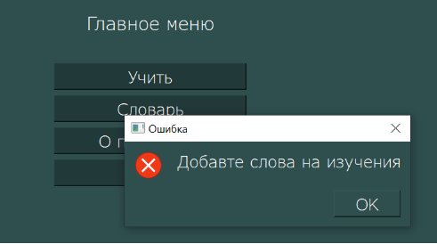
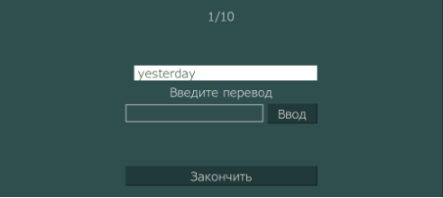
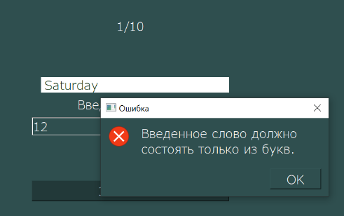
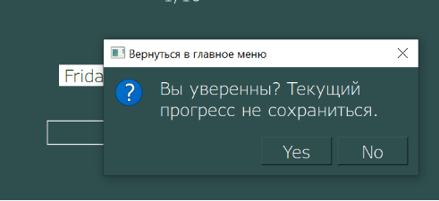
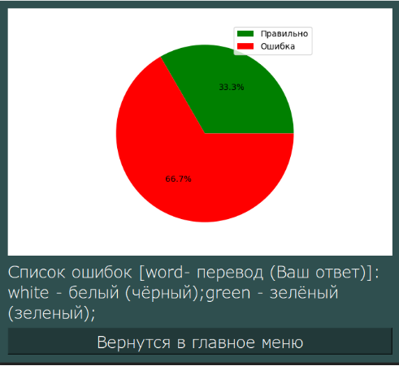
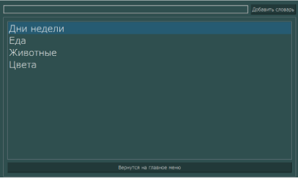
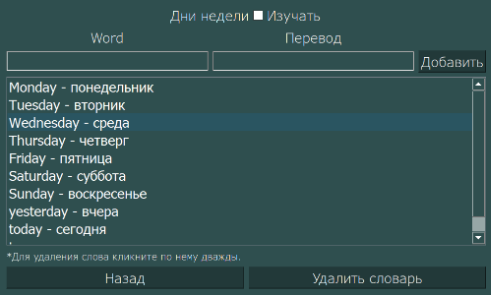
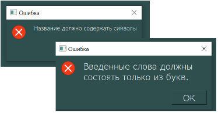
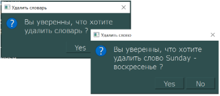
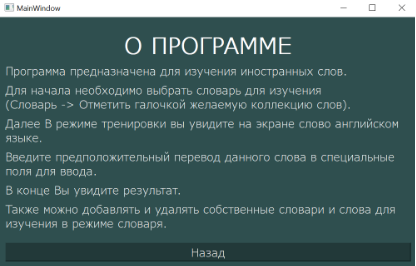

# application-for-learning-words
Первое что видит пользователь открыв приложение это экран «Главное меню», где расположены кнопки: Учить, Словарь, О программе, Выйти.

При нажатии на кнопку Учить при отсутствии в текущей базе данных отмеченных словарей на изучение, пользователь видит сообщение. 

Иначе запускается игровой процесс, который реализован на экране Тренировка, переход осуществляется с Главного меню по кнопке Учить. Здесь пользователю представлено слово на английском языке, пользователь вводит перевод данного слова, если данные введены не корректно выводится сообщение. При вводе корректных данных показывается следующее слово, данный процесс происходит пока не покажутся все слова выбранных словарей. Также пользователь имеет возможность закончить тренировку преждевременно, для этого пользователь должен подтвердить свой выбор нажав соответствующую кнопку на диалоговом окне.

По завершению тренировки перед пользователем появляется окно с Результатом.

Так же пользователь может просматривать, удалять и добавлять словари и слова через экран Словарь и экран Слова. При вводе некорректных данных в названии словаря и слов появляются окна с сообщением об ошибки в соответствии с рисунком 10. Также при удалении появляется диалоговое окно с подтверждением в соответствии с рисунком 11. Для добавления словаря для изучения необходимо в режиме списка слов, поставить соответствующий чекпоинт на против названия.

В окне о программе пользователю выводится инструкция работы с приложением.

